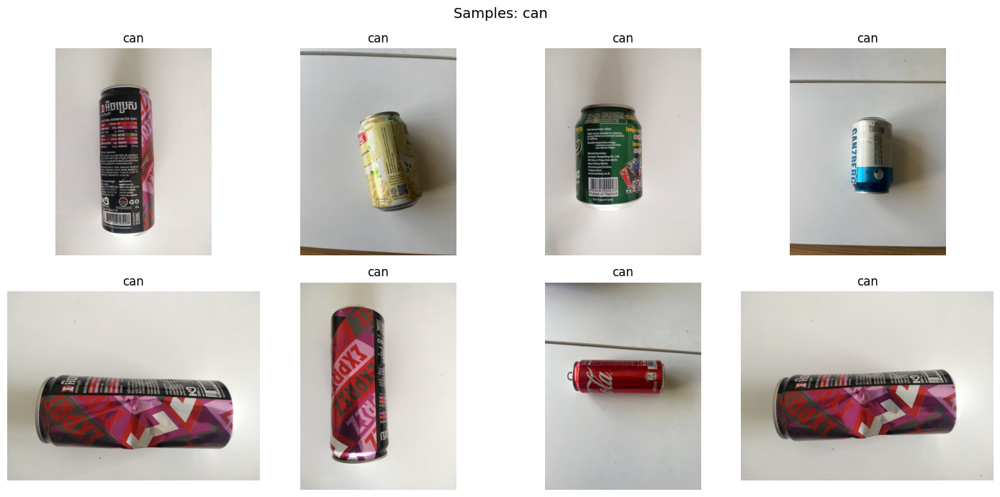

## Thung Thung: Reverse Vending Machine
A Reverse Vending Machine (RVM) is an automated device designed to collect used beverage containers, such as plastic bottles and aluminum cans, for recycling. In exchange, users receive a deposit refund, voucher, or reward, incentivizing sustainable waste management.

## E-Gen Competition
This project was developed for E-Gen (កម្មវិធីអ៊ីជេន), a competition focused on leveraging IoT technology and AI to solve green energy and environmental challenges in Cambodia. The event was led by the Directorate General of Youth under the Ministry of Education, Youth and Sport. Our team represented the Royal University of Phnom Penh (RUPP) during the presentation of this solution.

## Project Overview
Thung Thung utilizes a deep learning model to accurately classify waste into "Can" or "Plastic" categories. Specifically designed for a smart IoT ecosystem, the machine automatically sorts recyclables and manages user rewards.

This repository covers the entire structure, including:

- AI Development: A lightweight TFLite model optimized for real-time inference on a Raspberry Pi.

- Data Preprocessing: Techniques used to prepare the classification model for local Cambodian bottle and can types.

- Hardware Integration: Connecting sensors and motors to the Raspberry Pi for a fully functional prototype.

## Dataset for Trash Classification
The dataset for the Thung Thung Reverse Vending Machine (RVM) consists of 2,280 total images, specifically constructed to reflect the Cambodian context by focusing on local plastic bottle and aluminum can brands. To ensure the machine accurately distinguishes recyclables, we included 500 "Non-target" objects as an "Other" class, which allows the RVM to identify and reject non-recyclable waste. To increase variety and model robustness , the training set underwent for data augmentation, including rotations, horizontal and vertical flips, a 20% random zoom, and adjustments to brightness, to ensure the model remains accurate under the various lighting conditions inside the machine.

  

## Training Process
We trained our AI model using MobileNetV2, a compact neural network optimized for Raspberry Pi. Training happened in two phases: first, we froze the base model and trained only the classification head for 10 epochs (Adam optimizer, lr=1e-4) to recognize our three categories. Then, we unfroze the last 50 layers and fine-tuned for another 10 epochs (lr=1e-5) to adapt specifically to Cambodian bottles and cans. We used 224x224 images, batch size 32, 0.5 dropout, and early stopping callbacks. The final model was converted to TFLite (fp32) format for efficient inference on our Raspberry Pi.

## Hardware Components
The machine runs on a Raspberry Pi 3B model with the following components:
- **Sensors**: HX711 load cell (GPIO 5, 6) for weight sensing up to 50g, inductive proximity sensor (GPIO 26) for metal detection
- **Camera**: Logitech USB camera for real-time image capture
- **Sorting Mechanism**: Two servos via PCA9685 driver - gate servo (ch 15, 20-100°) directs items left/right, slapper servo (ch 0, 0-110°) pushes them through
- **Visual Feedback**: 8-pixel WS2812B LED strip (GPIO 18) flashes during scanning

## Raspberry Pi Setup
We deployed the TFLite model on the Pi with the following configuration:
- **Dependencies**: TensorFlow Lite, Flask, OpenCV, RPi.GPIO, adafruit-servokit, neopixel, HX711
- **Application**: Flask server on port 5000 serving kiosk UI and managing hardware control
- **Calibration**: Weight sensor calibrated with known weights, servos set to 500-2500μs pulse widths
- **Hybrid Classification**: AI predictions validated against sensor readings, rejecting mismatches.
- **User Workflow**: Start session → insert items → automatic sorting → QR code for rewards
- **Backend**: Transactions logged to remote API while all processing runs locally

**Note**: We built a separate server system to handle rewards and transaction tracking, making this RVM function like a real-world deployment. The QR code is generated only when users end their session, giving them the option to claim rewards or simply recycle without logging in. This flexibility lets people choose whether to save points or just contribute to recycling without any barriers.

## User Workflow
The machine is designed for a simple, intuitive recycling experience:

**1. Start Session**  
User presses "Start Session" on the touchscreen interface

**2. Insert Items**  
Insert bottles or cans one at a time into the collection slot

**3. Automatic Processing**  
→ Camera captures image  
→ LED lights flash indicating scan  
→ AI classifies the item (Can/Plastic/Other)  
→ Weight sensor + metal detector verify prediction  
→ Sorting mechanism directs: Plastics , Cans , Rejected.

**4. End Session**  
User presses "Stop Session" and views summary (total plastics, cans, rejected items, weight)

**5. Claim Rewards (Optional)**  
→ **Option A**: Scan the QR code to claim reward points via mobile app  
→ **Option B**: Walk away without claiming (no login required)

*Processing time: seconds per item | No pre-registration needed*

## Demo
Watch the full machine in action here: [YouTube Demo Link](https://youtu.be/_pXsI6E50Y4)

## Getting Started
To set up this project on your own Raspberry Pi:

1. Clone the repository: `git clone https://github.com/mutieta/Thung-Thung-Reverse-Vending-Machine`
2. Install dependencies: `pip install -r requirements.txt`
3. Install hardware libraries for Raspberry Pi (RPi.GPIO, adafruit-servokit, neopixel, HX711)
4. Create a `.env` file with your configuration (BASE_URL, PI_SECRET, BIN_ID)
5. Transfer the TFLite model to the `model/` directory
6. Calibrate the weight sensor using `hardware/scale.py`
7. Test individual components using scripts in the `hardware/` folder
8. Run the application: `python app.py`
9. Access the kiosk interface at `http://<raspberry-pi-ip>:5000`

## Project Contributors
This project was developed by RUPP students for the E-Gen Competition:
- **Sanna Nan** - [@mutieta](https://github.com/mutieta)
- **Ly Buntheng** - [@Newbieinthearea](https://github.com/Newbieinthearea)
- **Oum Chansopheak** - [@sopheakchan](https://github.com/sopheakchan)
- **Chhoun Oudom** - [@github-username](https://github.com/github-username)
- **An Srey Pov** - [@github-username](https://github.com/github-username)

## License
This project is licensed under the MIT License.